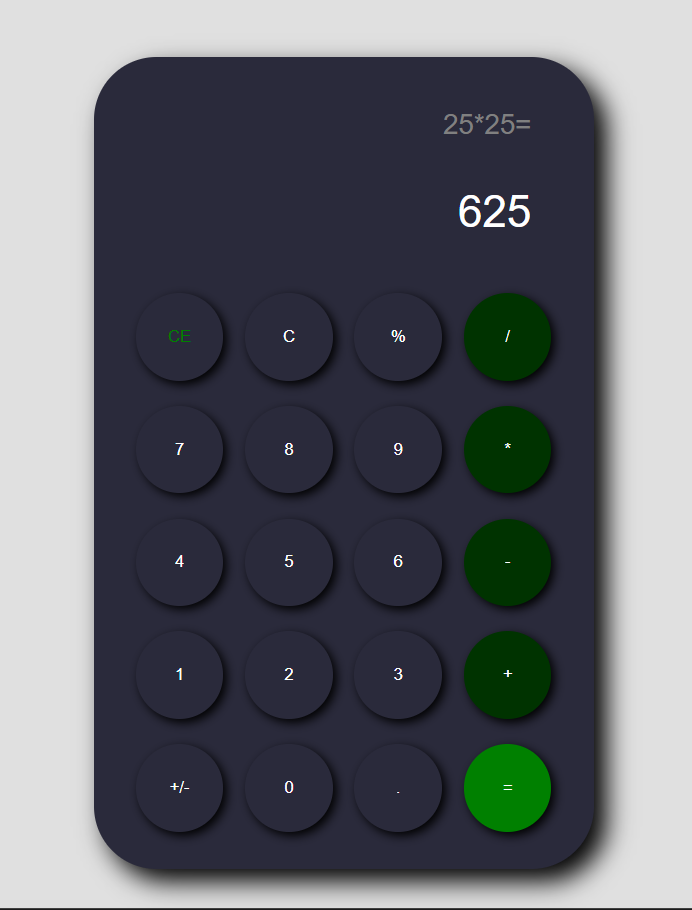

# Calculadora Interativa

Uma calculadora web simples e moderna, feita com **HTML, CSS e JavaScript**, que lida com operações básicas e porcentagens, utilizando até 4 casas de precisão, ideal para demonstração de lógica de programação e interface amigável. 

## Demonstração

